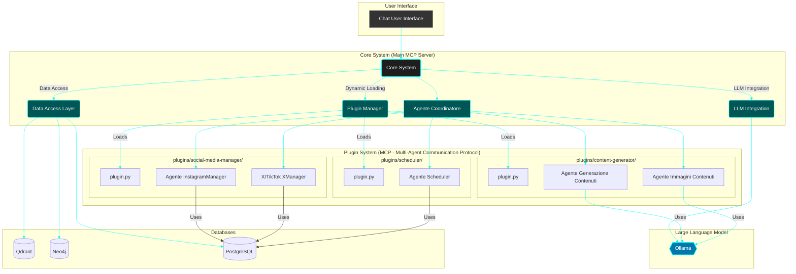

# Multi-Agent Framework con LLM e Database Integrati

## Descrizione del Progetto

Questo progetto mira a realizzare un framework multi-agente altamente modulare e scalabile, progettato per automatizzare una vasta gamma di task, con un focus iniziale sulla gestione autonoma di piattaforme social media come Instagram, X (Twitter) e TikTok. Il sistema è orchestrato da un Agente Coordinatore e si basa su un'architettura a plugin che permette di estendere facilmente le sue capacità.

Il cuore del sistema integra tecnologie all'avanguardia per la gestione dei dati, la conoscenza e l'intelligenza artificiale generativa:
*   **Qdrant:** Per la ricerca vettoriale e la memoria a lungo termine degli agenti.
*   **Neo4j:** Per la gestione dei grafi di conoscenza e delle relazioni complesse tra entità.
*   **PostgreSQL:** Per i dati strutturati, configurazioni e log.
*   **Ollama:** Come motore LLM configurabile per la generazione e comprensione del linguaggio naturale.

Tutti gli agenti sono coordinati da un **Agente Coordinatore** e interagiscono tramite un protocollo di comunicazione specifico (MCP - Multi-Agent Communication Protocol). L'interazione con l'utente avviene tramite una chat, che funge da interfaccia principale per impartire istruzioni e ricevere aggiornamenti.

L'architettura basata su plugin consente di aggiungere nuove funzionalità (es. gestione di nuove piattaforme social, generazione di tipi specifici di contenuto) semplicemente inserendo nuovi moduli in una cartella dedicata, rendendo il framework estremamente flessibile e "future-proof".

## Architettura del Sistema

Il framework è composto da un **Core System (Main MCP Server)** che gestisce l'orchestration, l'accesso ai dati e l'integrazione LLM. Intorno a questo core, i **Plugin** si agganciano dinamicamente, fornendo Agenti Specialisti e risorse aggiuntive. L'interfaccia utente è una **Chat** che comunica direttamente con il Core System.

Di seguito è presentato un diagramma schematico dell'architettura:

## Componenti Principali
1. Core System (Main MCP Server)
Agente Coordinatore: Interpreta le richieste dell'utente, scompone i task e delega le responsabilità agli agenti specialisti tramite il protocollo MCP.
Data Access Layer: Fornisce un'interfaccia unificata per interagire con Qdrant, Neo4j e PostgreSQL.
LLM Integration: Gestisce le chiamate a Ollama, permettendo la configurazione dinamica del modello LLM.
Plugin Manager: Scopre, carica e gestisce i plugin, integrando dinamicamente la loro logica e gli agenti nel sistema.
2. Database e Vector Store
Qdrant: Utilizzato come database vettoriale per la memorizzazione e la ricerca di embedding, fondamentale per la memoria a lungo termine degli agenti e la ricerca di contenuti.
Neo4j: Un database a grafo che modella le relazioni complesse tra entità, come utenti, contenuti, interazioni, dipendenze tra task e conoscenza generale del dominio.
PostgreSQL: Un robusto database relazionale per dati strutturati come configurazioni di sistema, impostazioni dei plugin, profili utente, log degli eventi e lo stato dei task.
3. LLM (Large Language Model)
Ollama: Un framework per l'esecuzione di modelli LLM in locale, offrendo flessibilità nella scelta e configurazione del modello (es. Llama 3, Mistral, ecc.) tramite le impostazioni del sistema.
4. Sistema di Plugin
Il framework è basato su un'architettura a plugin altamente estensibile. Ogni plugin è una directory separata nella cartella plugins/ e può contenere:
plugin.py: La logica principale del plugin, la definizione degli agenti specialisti e le funzioni esposte.
settings.py: Impostazioni specifiche del plugin che possono essere configurate dall'utente.
templates/ o ui/: File per l'interfaccia utente specifica del plugin, che possono essere serviti dal Core System.
models/: Definizioni di modelli di dati specifici del plugin.
tools/: Strumenti o API wrapper che gli agenti all'interno del plugin possono utilizzare.
Esempi di Plugin:
plugins/content-generator/: Contiene agenti per la generazione di testi, immagini e altri formati di contenuto.
plugins/social-media-manager/: Include agenti per l'interazione con le API di Instagram, X, TikTok per la pubblicazione e la gestione dei post.
plugins/scheduler/: Fornisce un agente per la programmazione e l'esecuzione di task in momenti specifici.
5. Interfaccia Utente
Chat User Interface: L'interfaccia principale attraverso cui gli utenti interagiscono con il framework, inviando comandi e ricevendo feedback dagli agenti.
Obiettivi Futuri
Espandere la libreria di plugin per supportare ulteriori piattaforme e funzionalità.
Migliorare le capacità di auto-apprendimento e adattamento degli agenti.
Sviluppare un'interfaccia utente più ricca e personalizzabile per i plugin.
Come Contribuire
[Se il progetto è open source, includere qui le linee guida per la contribuzione.]
Licenza
[Specificare la licenza del progetto, es. MIT License.]

---

**Note per l'uso del README:**

*   **Mermaid:** Per visualizzare il diagramma Mermaid, avrai bisogno di una piattaforma che supporti il rendering di Mermaid. GitHub, GitLab e molti editor Markdown (come VS Code con le estensioni appropriate) lo fanno.
*   **Immagine del grafico:** Se volessi includere l'immagine che ti ho generato in precedenza (quella visuale, non il codice Mermaid), dovresti caricarla in un repository (es. su GitHub) e poi fare riferimento ad essa nel README con la sintassi ``.
*   **Sezioni mancanti:** Ho lasciato alcuni segnaposto come "Come Contribuire" e "Licenza" che dovrai compilare in base alle tue intenzioni per il progetto.

Questo README fornisce una panoramica completa e dettagliata del tuo ambizioso framework.
